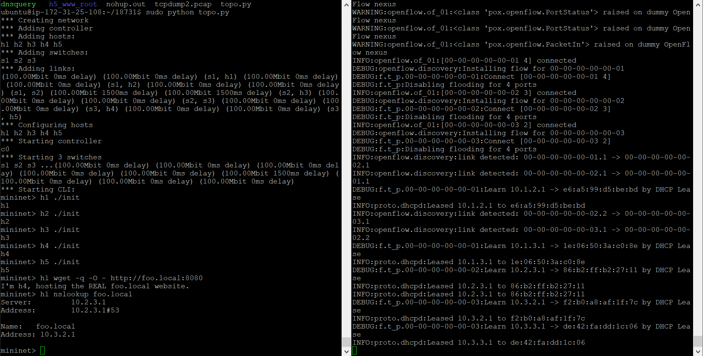
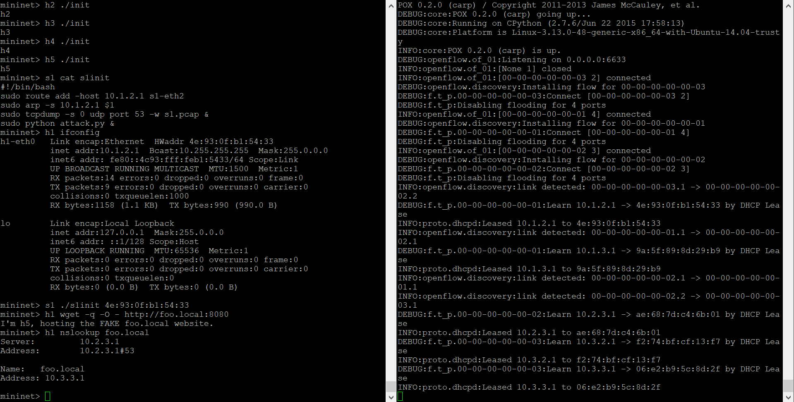

## DNS Spoofing Attacks

**Without attack:**

`init` is a script setting up resolv.conf on h1 and h2, setting up dnsmasq on h3, setting up web servers on h4 and h5.

On h1, use `wget` to retrieve content from http://foo.local:8080. The page content is correct. Also, `nslookup` returned correct result.

**With attack:**

This time, `s1init` is run on `s1` to do the DNS spoofing attack. Now, when h1 tries to retrieve content from http://foo.local:8080, he actually reaches h5, the fake foo.local website. And nslookup also shows the domain foo.local points to h5.

The log file of dnsmasq is shown here. The DNS query actually reached h3, but s1's spoofed DNS response reaches h1 first.

